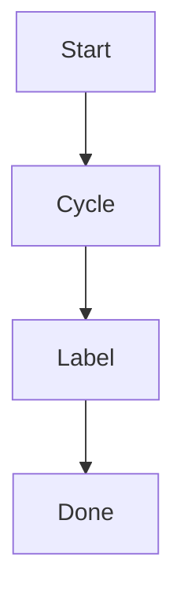

# Linear Manager Test Cases

This file defines a full reviewable test suite for `skills/linear-manager/scripts/linear_manager.py`.
All write tests are scoped to team `CF`.
Write commands are dry-run by default; add `--execute` for real mutation tests.

## 0) Test Setup

Run once in shell:

```bash
source ~/.zshrc
export CLI="python3 skills/linear-manager/scripts/linear_manager.py --pretty"
export TEAM_KEY="CF"
export DEST_TEAM_KEY="DEVOPS"
export TS="$(date +%Y%m%d-%H%M%S)"
```

Create IDs used by later cases:

```bash
PARENT_TITLE="[tc] parent ${TS}"
CHILD_TITLE="[tc] child ${TS}"
TOP_COMMENT="[tc] top-level comment ${TS}"
REPLY_COMMENT="[tc] threaded reply ${TS}"
```

## 1) Preflight And Policy

### TC-001 Help Entry
Command:

```bash
$CLI --help
```

Expected:
- Includes commands: `list templates get create update delete states children comments comment`.

### TC-002 Update Help Includes Team/Cycle/Label Options
Command:

```bash
$CLI update --help
```

Expected:
- Contains `--team-id --team-key`.
- Contains `--cycle-id --cycle-name --cycle-number`.
- Contains `--set-labels --add-labels --remove-labels`.

### TC-003 Delete Help Entry
Command:

```bash
$CLI delete --help
```

Expected:
- Contains `--confirm-delete`.
- Describes explicit confirmation before execution.

### TC-004 HTTP-Only Policy Check
Command:

```bash
rg -n "mcp__linear__" skills/linear-manager/scripts/linear_manager.py
```

Expected:
- No match in executable script (exit code `1`), proving runtime path is HTTP-only.
- (Optional) Running `rg -n "mcp__linear__" skills/linear-manager` may still show policy docs/prompts.

### TC-005 Missing Token Behavior
Command:

```bash
env -u LINEAR_API_TOKEN -u LINEAR_API_KEY HOME="$(mktemp -d)" \
  python3 skills/linear-manager/scripts/linear_manager.py list --limit 1
echo $?
source ~/.zshrc
```

Expected:
- Clear missing-token message with suggestions.
- Exit code `2`.

## 2) Ticket Read/Create

### TC-101 List CF Tickets
Command:

```bash
$CLI list --team-key "$TEAM_KEY" --limit 5
```

Expected:
- `issues.nodes` non-empty.
- Each item has `identifier`, `team.key`, `state.name`.

### TC-102 Read States
Command:

```bash
$CLI states --team-key "$TEAM_KEY"
```

Expected:
- Returns `team.states.nodes`.
- Contains at least one valid state name (for example `Todo`).

### TC-103 Create Parent Ticket (Dry-Run)
Command:

```bash
$CLI create --team-key "$TEAM_KEY" --title "$PARENT_TITLE" --description "parent desc" --priority medium --dry-run
```

Expected:
- `dryRun=true`.
- `input.teamId`, `input.title`, `input.priority`.

### TC-104 Create Parent Ticket (Real)
Command:

```bash
$CLI create --team-key "$TEAM_KEY" --title "$PARENT_TITLE" --description "parent desc" --priority medium --execute
```

Expected:
- `issueCreate.success=true`.
- Save `PARENT_ID` and `PARENT_IDENTIFIER` from response.

### TC-105 Get Parent Ticket
Command:

```bash
$CLI get --id "$PARENT_IDENTIFIER" --include-children --comments-limit 5
```

Expected:
- `issue.identifier == $PARENT_IDENTIFIER`.
- `issue.parent == null`.
- `issue.children.nodes` exists.

## 3) Sub-Ticket Flow

### TC-201 Create Child Ticket (Dry-Run)
Command:

```bash
$CLI create --team-key "$TEAM_KEY" --title "$CHILD_TITLE" --parent "$PARENT_IDENTIFIER" --description "child desc" --dry-run
```

Expected:
- `dryRun=true`.
- `input.parentId` exists.

### TC-202 Create Child Ticket (Real)
Command:

```bash
$CLI create --team-key "$TEAM_KEY" --title "$CHILD_TITLE" --parent "$PARENT_IDENTIFIER" --description "child desc" --execute
```

Expected:
- `issueCreate.success=true`.
- Save `CHILD_IDENTIFIER` from response.
- `issueCreate.issue.parent.identifier == $PARENT_IDENTIFIER`.

### TC-203 Read Child List From Parent
Command:

```bash
$CLI children --id "$PARENT_IDENTIFIER" --limit 20
```

Expected:
- `issue.children.nodes` contains `CHILD_IDENTIFIER`.

### TC-204 Read Child Ticket Directly
Command:

```bash
$CLI get --id "$CHILD_IDENTIFIER" --comments-limit 3
```

Expected:
- `issue.parent.identifier == $PARENT_IDENTIFIER`.

## 4) Update Fields And State

### TC-301 Update Title (Real)
Command:

```bash
$CLI update --id "$PARENT_IDENTIFIER" --title "[tc] parent title updated ${TS}" --execute
```

Expected:
- `issueUpdate.success=true`.
- New title visible in follow-up `get`.

### TC-302 Update Description Plain Text (Real)
Command:

```bash
$CLI update --id "$PARENT_IDENTIFIER" --description "plain description update ${TS}" --execute
```

Expected:
- `issueUpdate.success=true`.
- New description visible in follow-up `get`.

### TC-303 Update State By Name (Real)
Command:

```bash
$CLI update --id "$PARENT_IDENTIFIER" --state "Todo" --execute
```

Expected:
- `issueUpdate.success=true`.
- Follow-up `get` returns `issue.state.name == "Todo"`.

### TC-304 Update Priority (Real)
Command:

```bash
$CLI update --id "$PARENT_IDENTIFIER" --priority high --execute
```

Expected:
- `issueUpdate.success=true`.
- Follow-up `get` returns `priority=2`.

## 5) Cycle And Label Management

### TC-401 Update Cycle By Name (Real)
Command:

```bash
$CLI update --id "$PARENT_IDENTIFIER" --cycle-name "Cycle 25" --execute
```

Expected:
- `issueUpdate.success=true`.
- Follow-up `get` returns `issue.cycle.name == "Cycle 25"`.

### TC-402 Add Label By Name (Real)
Command:

```bash
$CLI update --id "$PARENT_IDENTIFIER" --add-labels "TEST" --execute
```

Expected:
- `issueUpdate.success=true`.
- Follow-up `get` labels contain `TEST`.

### TC-403 Remove Label By Name (Real)
Command:

```bash
$CLI update --id "$PARENT_IDENTIFIER" --remove-labels "TEST" --execute
```

Expected:
- `issueUpdate.success=true`.
- Follow-up `get` labels no longer contain `TEST`.

### TC-404 Set Labels By Name (Real)
Command:

```bash
$CLI update --id "$PARENT_IDENTIFIER" --set-labels "TEST" --execute
```

Expected:
- `issueUpdate.success=true`.
- Follow-up `get` labels exactly set to requested list (subject to dedupe/order semantics).

## 6) Rich Description (Emoji + Chart)

### TC-501 Update Description From File With Emoji And Mermaid
Command:

~~~bash
cat > /tmp/linear_tc_desc.md <<'EOF'
### Description Regression ✅

Validate unicode, emoji, and chart markdown.

- Emoji: 🚀 ✅ 📈
- Date: 2026-03-18


EOF

$CLI update --id "$PARENT_IDENTIFIER" --description-file /tmp/linear_tc_desc.md --execute
~~~

Expected:
- `issueUpdate.success=true`.
- Follow-up `get` returns full markdown content unchanged (including emoji and mermaid block).

## 7) Comment Read/Create/Thread Reply

### TC-601 Read Comments
Command:

```bash
$CLI comments --id "$PARENT_IDENTIFIER" --limit 20
```

Expected:
- Returns comment list payload successfully.

### TC-602 Create Top-Level Comment (Real)
Command:

```bash
$CLI comment --id "$PARENT_IDENTIFIER" --body "$TOP_COMMENT" --execute
```

Expected:
- `commentCreate.success=true`.
- Save returned `TOP_COMMENT_ID`.

### TC-603 Create Threaded Reply Under Top Comment (Real)
Command:

```bash
$CLI comment --id "$PARENT_IDENTIFIER" --parent-comment-id "$TOP_COMMENT_ID" --body "$REPLY_COMMENT" --execute
```

Expected:
- `commentCreate.success=true`.
- In UI, reply appears under the parent comment.

### TC-604 Read Back Comments
Command:

```bash
$CLI comments --id "$PARENT_IDENTIFIER" --limit 20
```

Expected:
- Contains both top-level and reply comment bodies.

## 8) Combined Final Readback

### TC-701 Final Get Snapshot
Command:

```bash
$CLI get --id "$PARENT_IDENTIFIER" --include-children --comments-limit 20
```

Expected:
- Parent + child linkage present.
- Updated `title`, `description`, `state`, `cycle`, `labels` present.
- Comments list present with test comments.

## 9) Team Move And Delete

### TC-801 Team Move Dry-Run
Command:

```bash
$CLI update --id "$CHILD_IDENTIFIER" --team-key "$DEST_TEAM_KEY" --dry-run
```

Expected:
- `dryRun=true`.
- `input.teamId` exists.
- `targetTeam.key == $DEST_TEAM_KEY`.

### TC-802 Team Move Conflict With State
Command:

```bash
$CLI update --id "$CHILD_IDENTIFIER" --team-key "$DEST_TEAM_KEY" --state "Todo" --dry-run
echo $?
```

Expected:
- Error explains that team move cannot be combined with state/cycle/label updates.
- Exit code `1`.

### TC-803 Team Move Real
Command:

```bash
$CLI update --id "$CHILD_IDENTIFIER" --team-key "$DEST_TEAM_KEY" --execute
```

Expected:
- `issueUpdate.success=true`.
- Save `MOVED_CHILD_IDENTIFIER` from `issueUpdate.issue.identifier`.
- `issueUpdate.issue.team.key == $DEST_TEAM_KEY`.

### TC-804 Read Moved Child By New Identifier
Command:

```bash
$CLI get --id "$MOVED_CHILD_IDENTIFIER" --comments-limit 3
```

Expected:
- Request succeeds with the post-move identifier.
- Returned `issue.team.key == $DEST_TEAM_KEY`.

### TC-805 Delete Dry-Run
Command:

```bash
$CLI delete --id "$MOVED_CHILD_IDENTIFIER" --dry-run
```

Expected:
- `dryRun=true`.
- Response includes `issue.identifier == $MOVED_CHILD_IDENTIFIER`.
- Response includes `expectedConfirmation == $MOVED_CHILD_IDENTIFIER`.

### TC-806 Delete Rejected Without Confirmation
Command:

```bash
$CLI delete --id "$MOVED_CHILD_IDENTIFIER" --execute
echo $?
```

Expected:
- Error explains that explicit confirmation is required.
- Exit code `1`.

### TC-807 Delete Rejected With Mismatched Confirmation
Command:

```bash
$CLI delete --id "$MOVED_CHILD_IDENTIFIER" --confirm-delete BAD-999 --execute
echo $?
```

Expected:
- Error explains confirmation mismatch and shows the expected identifier.
- Exit code `1`.

### TC-808 Delete Real
Command:

```bash
$CLI delete --id "$MOVED_CHILD_IDENTIFIER" --confirm-delete "$MOVED_CHILD_IDENTIFIER" --execute
```

Expected:
- `issueDelete.success=true`.
- Returned deleted issue identifier matches `$MOVED_CHILD_IDENTIFIER`.

## 10) Negative And Conflict Cases

### TC-901 Invalid Identifier
Command:

```bash
$CLI get --id BAD
echo $?
```

Expected:
- Error message for invalid identifier format.
- Exit code `1`.

### TC-902 Invalid Priority
Command:

```bash
$CLI update --id "$PARENT_IDENTIFIER" --priority P0 --dry-run
echo $?
```

Expected:
- Validation error for priority enum.
- Exit code `1`.

### TC-903 Cycle Selector Conflict
Command:

```bash
$CLI update --id "$PARENT_IDENTIFIER" --cycle-id 11111111-1111-1111-1111-111111111111 --cycle-name "Cycle 25" --dry-run
echo $?
```

Expected:
- Error: only one cycle selector allowed.
- Exit code `1`.

### TC-904 Label Set/Add Conflict
Command:

```bash
$CLI update --id "$PARENT_IDENTIFIER" --set-labels "TEST" --add-labels "bug bash" --dry-run
echo $?
```

Expected:
- Error: cannot mix set-labels with add/remove.
- Exit code `1`.

### TC-905 Unknown Label Name
Command:

```bash
$CLI update --id "$PARENT_IDENTIFIER" --add-labels "__NOT_EXIST__" --dry-run
echo $?
```

Expected:
- Error includes unknown label name.
- Exit code `1`.

### TC-906 Unknown Cycle Name
Command:

```bash
$CLI update --id "$PARENT_IDENTIFIER" --cycle-name "__NOT_EXIST__" --dry-run
echo $?
```

Expected:
- Error includes unknown cycle name.
- Exit code `1`.

### TC-907 UUID Path For Get
Command:

```bash
$CLI get --id "<PARENT_ID_UUID>" --comments-limit 1
```

Expected:
- Succeeds using UUID input path.
- Returned `issue.identifier == $PARENT_IDENTIFIER`.

### TC-908 Update State By state-id
Command:

```bash
$CLI update --id "$PARENT_IDENTIFIER" --state-id "<STATE_ID>" --execute
```

Expected:
- `issueUpdate.success=true`.
- No state-name resolution required.

### TC-909 Update Cycle By cycle-number
Command:

```bash
$CLI update --id "$PARENT_IDENTIFIER" --cycle-number 63 --execute
```

Expected:
- `issueUpdate.success=true`.
- Follow-up `get` shows cycle number/name match.

### TC-910 Update Label By label-id
Command:

```bash
$CLI update --id "$PARENT_IDENTIFIER" --add-label-ids "<LABEL_ID>" --execute
```

Expected:
- `issueUpdate.success=true`.
- Follow-up `get` labels include `<LABEL_ID>`.

### TC-911 Comment Via body-file
Command:

```bash
cat > /tmp/linear_tc_comment.md <<'EOF'
[tc] comment from body-file
EOF
$CLI comment --id "$PARENT_IDENTIFIER" --body-file /tmp/linear_tc_comment.md --execute
```

Expected:
- `commentCreate.success=true`.
- Returned comment body matches file content.

### TC-912 Comment Via body-stdin
Command:

```bash
printf "[tc] comment from body-stdin" | $CLI comment --id "$PARENT_IDENTIFIER" --body-stdin --execute
```

Expected:
- `commentCreate.success=true`.
- Returned comment body matches stdin content.

### TC-913 Missing description-file Error
Command:

```bash
$CLI update --id "$PARENT_IDENTIFIER" --description-file /tmp/does-not-exist.md --dry-run
echo $?
```

Expected:
- Error mentions file not found.
- Exit code `1`.

## 12) Templates

### TC-1001 Templates Help Entry
Command:

```bash
$CLI templates --help
```

Expected:
- Contains `--team-id`, `--team-key`, `--type`, `--name`, and `--include-archived`.

### TC-1002 List COR Templates
Command:

```bash
$CLI templates --team-key COR
```

Expected:
- Returns `templates`.
- Contains `COR / Issue Templates 2025`.
- Contains workspace-level templates where `team == null`.

### TC-1003 Create With Default Template (Dry-Run)
Command:

```bash
$CLI create --team-key "$TEAM_KEY" --title "[tc] default template ${TS}" --use-default-template --dry-run
```

Expected:
- `dryRun=true`.
- `input.useDefaultTemplate=true`.
- This only validates that the input field is set; real execution requires the target team to have a default template configured in Linear.

### TC-1004 Create With Template Name (Dry-Run)
Command:

```bash
$CLI create --team-key "$TEAM_KEY" --title "[tc] template name ${TS}" --template-name "Issue Templates 2025" --dry-run
```

Expected:
- `dryRun=true`.
- `input.templateId` exists.
- `resolvedTemplate.name == "Issue Templates 2025"`.

### TC-1005 Create With Template ID (Dry-Run)
Command:

```bash
VALID_TEMPLATE_ID="<VALID_ISSUE_TEMPLATE_ID_FOR_TEAM_KEY>"
$CLI create --team-key "$TEAM_KEY" --title "[tc] template id ${TS}" --template-id "$VALID_TEMPLATE_ID" --dry-run
```

Expected:
- `dryRun=true`.
- `input.templateId == $VALID_TEMPLATE_ID`.
- `resolvedTemplate.type == "issue"`.

### TC-1006 Missing Template ID
Command:

```bash
$CLI create --team-key "$TEAM_KEY" --title "[tc] missing template ${TS}" --template-id 11111111-1111-1111-1111-111111111111 --dry-run
echo $?
```

Expected:
- Error explains that the template was not found.
- Exit code `1`.

### TC-1007 Non-Issue Template Rejected
Command:

```bash
PROJECT_TEMPLATE_ID="<PROJECT_TEMPLATE_ID_FROM_templates_--type_project>"
$CLI create --team-key "$TEAM_KEY" --title "[tc] project template ${TS}" --template-id "$PROJECT_TEMPLATE_ID" --dry-run
echo $?
```

Expected:
- Error explains that create only supports issue templates.
- Exit code `1`.

### TC-1008 Other-Team Template Rejected
Command:

```bash
OTHER_TEAM_TEMPLATE_ID="<ISSUE_TEMPLATE_ID_SCOPED_TO_NON_TEAM_KEY_TEAM>"
$CLI create --team-key "$TEAM_KEY" --title "[tc] other team template ${TS}" --template-id "$OTHER_TEAM_TEMPLATE_ID" --dry-run
echo $?
```

Expected:
- Error explains that the template is scoped to another team.
- Exit code `1`.

### TC-1009 Ambiguous Template Name
Command:

```bash
AMBIGUOUS_TEMPLATE_NAME="<NAME_SHARED_BY_TEAM_AND_WORKSPACE_TEMPLATES>"
$CLI create --team-key "$TEAM_KEY" --title "[tc] ambiguous template ${TS}" --template-name "$AMBIGUOUS_TEMPLATE_NAME" --dry-run
echo $?
```

Expected:
- Error explains that the template name matched multiple candidates.
- Error lists candidate `id/team/name` details.
- Exit code `1`.

### TC-1010 Template Selector Conflict
Command:

```bash
$CLI create --team-key "$TEAM_KEY" --title "[tc] selector conflict ${TS}" --template-id "$VALID_TEMPLATE_ID" --use-default-template --dry-run
echo $?
```

Expected:
- `argparse` rejects the mutually exclusive template selectors.
- Exit code `2`.

### TC-1011 Create Sub-Issue With Template (Dry-Run)
Command:

```bash
$CLI create --team-key "$TEAM_KEY" --title "[tc] sub template ${TS}" --template-id "$VALID_TEMPLATE_ID" --parent "$PARENT_IDENTIFIER" --dry-run
```

Expected:
- `dryRun=true`.
- `input.templateId == $VALID_TEMPLATE_ID`.
- `input.parentId` exists.

## 13) Optional Cleanup

If you want cleanup after review:
- Move test issues to a terminal state (for example `Canceled`) with `update --state`.
- Restore or review deleted test issues in Linear archives if needed.
- Or manually archive remaining test issues in Linear UI.
